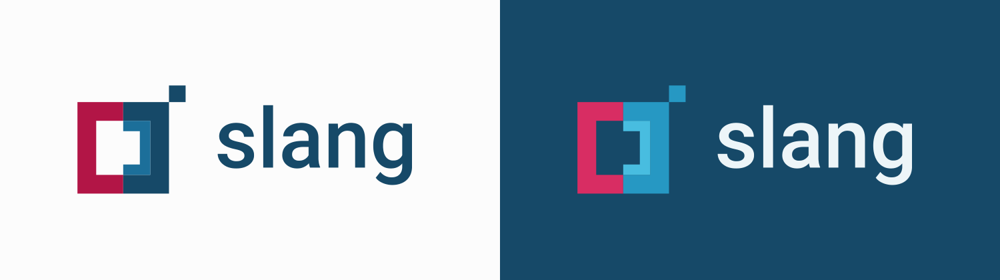

# Slang logo and brand

[Preview and download the artwork](https://design.slang.bitspark.com/#/brand).



The mark preserves the later Slang cloud logo's opposing brackets, inset connector, and raised square. It is redrawn on a clean coordinate grid from `slang.cloud/src/assets/logo.png` at revision `c5d49c23f044f93cf6e1b032f0276c5504942980`. The light/dark palettes and Roboto wordmark are adaptations for the shared design system.

## Name and capitalization

**Slang** is the canonical written name of the language and product. Use it in prose, headings, navigation, buttons, onboarding, help text, error messages, and accessible names.

| Context                    | Convention                                         | Examples                                                              |
| -------------------------- | -------------------------------------------------- | --------------------------------------------------------------------- |
| Product and language names | Capitalize the initial S.                          | Slang, Slang Design, Slang Editor, Slang Run, Built with Slang        |
| Logo artwork               | Keep the approved lowercase wordmark.              | The outlined `slang` lettering in the supplied SVGs                   |
| Technical identifiers      | Preserve the identifier's exact spelling and case. | `slang`, `slangd`, `@bitspark/slang-design`, `slang.run`, `SLANG_DIR` |

Use “Welcome to Slang” and “Update your Slang version,” rather than “Welcome to SLANG” or “Update your slang version.” Do not use **SLANG** as an alternative brand name or treat the name as an acronym.

The lowercase wordmark is a visual choice; its accessible name is still “Slang.” References to commands, packages, repositories, domains, filenames, environment variables, and other identifiers retain their exact case. Use code formatting for technical identifiers where appropriate, such as “Run `slang` to execute a blueprint.”

If a layout calls for an all-capital label, keep “Slang” in the source text and apply capitalization through presentation styling. That treatment does not change the written name.

## Choose by background

The suffix describes the **background**, not the color of the logo. These files do not change with the operating system's theme: choose the appropriate file for the actual surface behind it.

| Surface                            | Full logo                                                   | Symbol                                                              |
| ---------------------------------- | ----------------------------------------------------------- | ------------------------------------------------------------------- |
| White, paper, pale gray            | [slang-logo-light.svg](../assets/logo/slang-logo-light.svg) | [slang-mark-light.svg](../assets/logo/slang-mark-light.svg)         |
| Petrol, charcoal, dark gray        | [slang-logo-dark.svg](../assets/logo/slang-logo-dark.svg)   | [slang-mark-dark.svg](../assets/logo/slang-mark-dark.svg)           |
| One-color print on light           | [slang-logo-black.svg](../assets/logo/slang-logo-black.svg) | [slang-mark-black.svg](../assets/logo/slang-mark-black.svg)         |
| Reversed artwork on dark           | [slang-logo-white.svg](../assets/logo/slang-logo-white.svg) | [slang-mark-white.svg](../assets/logo/slang-mark-white.svg)         |
| Uncontrolled background / app icon | —                                                           | [slang-mark-universal.svg](../assets/logo/slang-mark-universal.svg) |

The eight light/dark/one-color files have transparent backgrounds. The universal app icon deliberately uses a charcoal tile with a contrasting border. `assets/slang-mark.svg` remains a compatibility copy of that app icon and supplies the showcase favicon. The navigation uses the transparent wordmark matched to its surface.

All visible artwork is made from SVG paths. The app icon additionally uses a rounded vector rectangle. The full logo's Roboto Medium lettering is outlined, so it renders without fonts installed and never falls back to a different typeface. There are no embedded bitmaps, linked images, scripts, or external resources. SVG editors can edit the individual fills and paths.

## Web use

```js
import lightLogo from '@bitspark/slang-design/logo/slang-logo-light.svg';
import darkLogo from '@bitspark/slang-design/logo/slang-logo-dark.svg';
```

Use the URL that matches your component's surface. With plain static HTML, copy the SVG files alongside your site:

```html
<!-- A bright surface: light means "for a light background". -->


<!-- A dark surface. -->

```

Give a meaningful standalone logo `alt="Slang"`. Use `alt=""` when adjacent text already names Slang. Keep an accessible name on a linked logo, such as the home destination. Do not rely on CSS `currentColor` crossing into an external SVG image.

## GitHub READMEs

Use a `<picture>` with a dark-theme source and a light-theme fallback. GitHub selects the SVG that matches the reader's color mode. The artwork stays transparent and sharp at every size; no dark tile or CSS filter is needed.

For another Slang repository, use the published Slang Design v0.2.1 artwork at its fixed commit:

```html
<p align="center">
  <picture>
    <source
      media="(prefers-color-scheme: dark)"
      srcset="
        https://raw.githubusercontent.com/Bitspark/slang-design/a16912ee2938ad9202380c88ce486adf893e5ccf/assets/logo/slang-logo-dark.svg
      "
    />
    
  </picture>
</p>
```

For a standalone symbol, use the corresponding mark files:

```html
<picture>
  <source
    media="(prefers-color-scheme: dark)"
    srcset="
      https://raw.githubusercontent.com/Bitspark/slang-design/a16912ee2938ad9202380c88ce486adf893e5ccf/assets/logo/slang-mark-dark.svg
    "
  />
  
</picture>
```

These URLs share one approved asset source across repositories. Keep both variants pinned to the same revision when updating them. In this repository, use relative paths such as `assets/logo/slang-logo-light.svg` from the root README. Renderers without picture support use the light `` fallback.

For an application with its own theme switch or a surface that differs from the page theme, select the file based on the actual component background as described above.

## Size and clear space

- Preserve the `356 × 128` full-logo or `128 × 128` symbol aspect ratio. Scale uniformly.
- Use the symbol at **24 px** or larger and the full logo at **112 px** or larger. The small app-icon specimens in the gallery show 24, 32, 48, and 72 px sizes.
- Leave at least **18 viewBox units** of clear space around the visible artwork: the width of the main bracket stroke. The SVG includes some padding; add surrounding layout space where needed.
- Use the app icon or a quiet solid panel on photos and patterned surfaces. A transparent logo cannot guarantee contrast on every possible image.
- Keep the shapes flat. Do not stretch, rotate, add shadows, or remove the raised square.

## Artwork and attribution

The light variant uses raspberry `#b21546`, petrol `#164968`, and blue `#1c6f9a`. The dark variant uses rich raspberry `#d82d63`, saturated blue `#2698c3`, and cyan `#48bde0` in the symbol, with pale ink `#edf5f8` reserved for the lettering. The contained app icon uses the same saturated symbol colors. These are explicit surface adaptations of the existing identity, not automatic recoloring based on a guessed background.

The lowercase wordmark comes from the bundled Roboto Medium outlines; see [Roboto's license](../assets/licenses/roboto.txt). The Slang name and mark identify Bitspark. See [NOTICE](../NOTICE) for attribution and brand-use terms.
